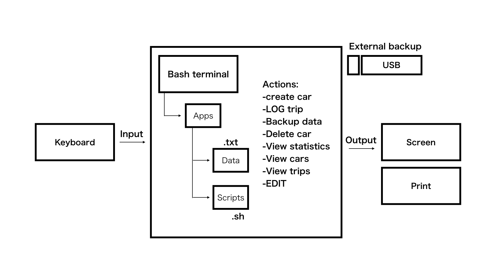
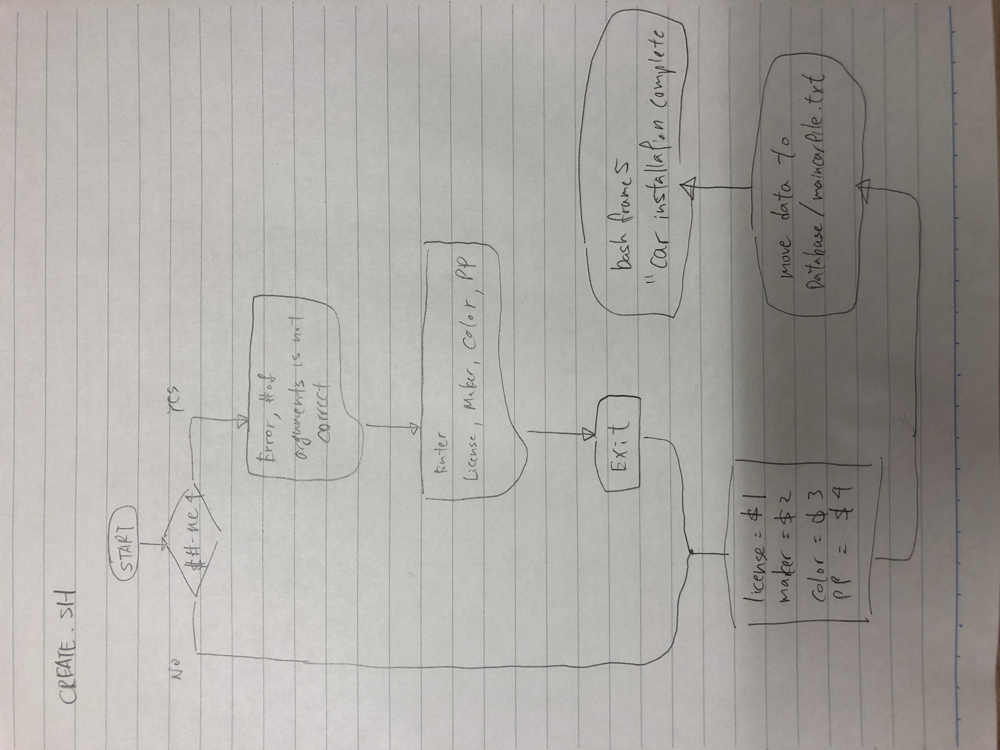
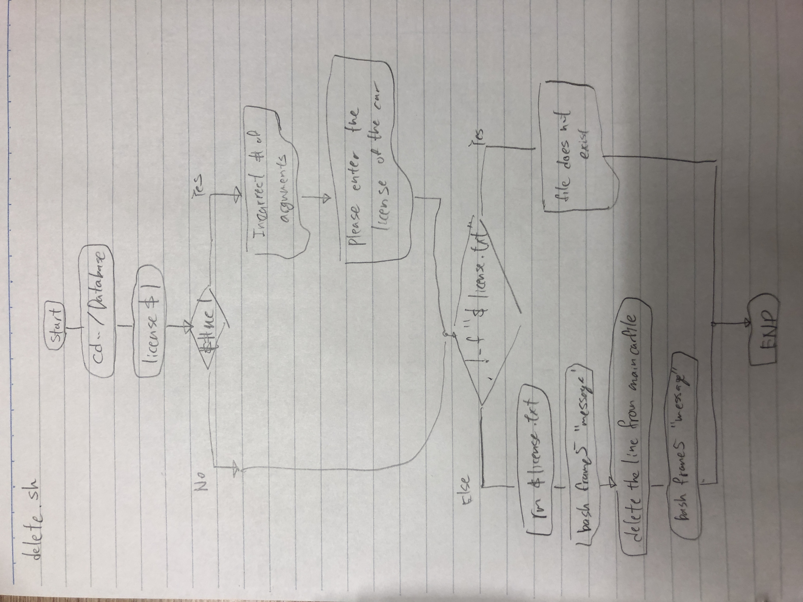
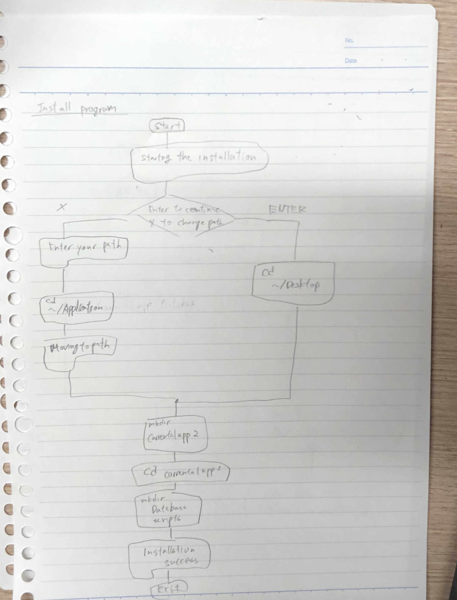

Car Rental Minimal App
===========================

A car rental management minimal app in Bash.

Contents
-----
  1. [Planning](#planning)
  1. [Design](#design)
  1. [Development](#development)
  1. [Manpage](#manpage)
  1. [Evalution](#evaluation)

Planning
----------
**Defining the Problem (Topic 1.1.1)**

We are creating some project for rental car shop that can make entire check in and check out process more smooth and seamless. First of all, moving all the data and systems inside our application, so they can keep everything in one place.
This app memorizes all the car types, date and mileage. It is easier for the owner to keep everything in touch. 
Planning to make some application system with really easy installation. Since the rental shop's owner are not feeling confident with all the techy things, this app can be easily installed by attaching USB disks. After that, just activate our program inside and do all the process to execute the work.


### Solution proposed
I decided to use BASH to program Car rental project.
It is more simple to both code and execute by using bash program.

### Success Criteria
These are measurable outcomes
1. A car can be created and stored in the database.
1. A car information can be edited.
1. A car can be deleted from the database be recorded ad stored for an existing car.
1. The installation is ***simple-> one step process***.
1. A summary (total/average distance traveled) can be generated for a particular car.
1. Trips can be recorded ad stored for an existing car.
1. A basic daravase system is implemented.
1. A basic backup functionality is available.

Design
---------






Development
--------
***Install program***

1. Get inputs (Ask where to install the app)
2. If they "Enter", continue the process.
3. If they press "X", change the installation path.
4. Read inputs ($path)
5. Install file to $path

```sh
#!/bin/bash

#This file creates the folder structure for the
#minimal Car Rental App

echo "Starting the installation"
echo "Default install path is /Desktop/"
echo "Press Enter to continue installation"
echo "press x to change the installation path"

read sel

#checking what user entered
if [[ ($sel == x) ]];then
    echo "Enter installation path, then press Enter"
    read loc

    #moving to the desired location
    cd $loc
    echo "moving to $path"

else
  #moving to default location
  cd ~/Desktop
fi

#Create App folder
mkdir carrentalapp

#move to created folder
cd carrentalapp

#create for database and scripts
mkdir Database
mkdir scripts

echo "structure created successfully"
```

***Backup system***
1. Read inputs ($location)
2. Check the word# of the inputs
3. If its -ne to 1 show ***message***
4. If its not, execute backup process.
5. Show message "message"

```sh
#!/bin/bash

#This program will backup the entirity of the database folder within the carrentalapp.

location=$1

if [[ $# -ne 1 ]]; then
	echo "Sorry, there was an error with backing up your files."
	exit
else
	cp -a /Users/keitaromae/Desktop/carrentalapp/Database $location
	echo "Successfully backed up into $location."
fi
```
***Create***
1. Get inputs
2. Check # for arguments ex.) 
   ***if 4 then continue, if not exit "message"***
3. Write to main file with one extra line. Not erasing other entries.
4. Create car trip file with License plate.txt
```sh
#!/bin/bash

#This program let the user to type information in, and it will automatically write it down
#to the file maincarfile.txt

if [ $# -ne 4 ]; then
	echo "Wrong input. Please enter Plate, Model, Color and Passengers"
	exit
fi

#Number of arguments is correct. Continue
plate=$1
model=$2
color=$3
PP=$4

#Adding new entry to file maincarfile.txt
echo "$plate $model $color $PP" >> maincarfile.txt

bash frame "Car created successfully"
```
***Record***
1. Get inputs
2. Check # for arguments ex.)
***if 4 then continue, if not "message"***
3. Write the inputs to Database's .txt file.
4. Show message ex.)
***Data has been stored correctly***

```sh
#!/bin/bash

#This program records license plate, Km, datein, dateout

if [ $# -ne 4 ]; then
	echo "please enter license, km, datein, dateout"
	exit
fi

plate=$1
km=$2
datein=$3
dateout=$4

echo "$km, $datein, $dateout" >> ../Database/$plate.txt

bash frame5 "data has been stored correctly"
```

***Frame***
1. Check the length of the word typed by the user.
2. Insert that word inside the frame of "*"
3. Line the word to the middle of the frame.

```sh
#!/bin/bash

echo "enter"

#this code reads argument, which is bash frame *argument
word=$1


for (( i=0; i<100; i++ ))
do
echo -n "*"
done
echo " "


echo -n "*"


for (( i=1; i<99; i++ ))
do
	echo -n " "
done
echo -n "*"
echo " "

len=${#word}
(( spacing=(100-$len)/2 ))

echo -n "*"
for (( i=1; i<$spacing; i++))
do
	echo -n	" "
done

echo -n $word


for (( i=( 100-$spacing ); i<99; i++))
do
	echo -n " "
done

(( odd=($spacing+$spacing+$len) ))
if [ $odd -eq 99 ]; then
echo -n " "
fi
echo -n "*"


echo " "
echo -n "*"
for (( i=1; i<99; i++ ))
do
        echo -n " "
done
echo -n "*"
echo " "

for (( i=0; i<100; i++ ))
do
echo -n "*"
done
echo " "

```
***Edit car***
1. Read inputs
2. Check the # of the inputs
3. If it's -ne to 4, show message "error with the number of arguments" exit
4. Move to Database
5. If the file name was 
```sh
#!/bin/bash
#This program edit the information of an exiting car in the
#maincarfile
#user enters [license place] [model] [red] [pp]

if [ $# -ne 4 ]; then
  echo "Error with the number of arguments"
  echo "Enter License Maker Model Passengers"
  exit
fi

license=$1
maker=$2
model=$3
pp=$4

cd ../Database

if [ ! -f "$license.txt" ]; then
  echo "File not found!"
fi

#find the line with the given car plate and delete it
sed -i '' "/^$license/d" maincarfile.txt
#add the new information
echo "$license $maker $model $pp" >> maincarfile.txt
cd ../scripts
bash frame2 "Car edited successfully"
```
***Delete car***
1. Moving to Database file
2. Read inputs
3. Check for # of inputs
4. If its -ne to 1, show message ***Input is wrong, please try again***
5. If there is no file that user entered, show message ***File doesn't exist, try again***
6. ELSE, execute the deleting process.
7. Show message "The information was successfully deleted"

```sh
#!/bin/bash
#This program is for deleting a single car file

#moving to database file
cd ../db/
#check that argument was provided
#get argument of plate and check if it exits and delete the car file
plate=$1
if [[ ($# -ne 1) ]];then
	echo "Input is wrong, please type Plate again"
elif [ ! -f "$1.txt" ];then
	echo "The file don't exis. Please try again"
else 
	rm $1.txt
	bash frame5 "The file was successfully deleted"
	#delete whole line which includes the plate
	sed -i '' "/$1/d" maincarfile.txt
	bash frame5 "The car information was successfully deleted"
fi
exit 
```
***Summary***
1. Check the number of arguments (display on frame)
2. If the # is -ne 1 show message "enter a license"
3. Check if the file exists or not
4. If it didn't show message "file does not exist" exit
5. Calculate the total KM
6. Show the result (display on frame)
```sh
#!/bin/bash

#This script generates summary for a given car
bash frame5 Summary

#step 1: check the number of arguments
if [ $# -ne 1 ];then
  echo "Enter a licence"
  exit
fi

#step 2: checking the file exist in the database
cd ../Database/
FILE=$1
if [ ! -f "$FILE.txt" ];then
  echo "File for car $FILE does not exist. Starting summary"
  exit
fi

#step 3: calculate the total km
total=0
while read line;
do
  for km in $line
  do
    (( total=$total+$km))
    break
  done
done < "$FILE.txt"

#step 4: show result nicely.
cd ../scripts/
bash frame5 "total distance traveled for $FILE was $total"
exit
```

Manpage
-----------
***Man page for create.sh***
```man
.\" Manpage for create
.TH man 6 "28 Oct 2019" "1.0" "create man page"
.SH NAME
create \- create a new car
.SH SYNOPSIS
bash create.sh [license] [model] [color] [passengers]
.SH DESCRPITION
create is a script that creates new record in the database
.SH EXAMPLES
bash create.sh LXH798 Mazda Red 3
.SH AUTHOR
Programmer_Keitaro Mae
```

***Man page for frame5***
```man
.\" Manpage for frame
.TH man 6 "1 Nov 2019" "1.0" "frame man page"
.SH NAME
frame \- frame made out of "*" that goes around the word
.SH SYNOPSIS
bash frame5 [random word]
.SH DESCRPITION
user input $random word will appear inside the frame of "*"
.SH EXAMPLES
bash frame5 jesus
.SH AUTHOR
Programmer_Keitaro Mae
```

***Man page for backup.sh***
```man
.\" Manpage for backup.sh
.TH man 6 "1 Nov 2019" "1.0" "backup man page"
.SH NAME
backup \- takes backup of the system
.SH SYNOPSIS
bash backup [$location]
.SH DESCRPITION
It will create a backup file to the location user typed.
.SH EXAMPLES
bash backup.sh $location
.SH AUTHOR
Programmer_Keitaro Mae
```

Evaluation
-----------
Test 1:
The first run of the test file was unsuccessfull because the Database folder was not existent.
Also the create program did not store the license file inside the Database folder. Changing the line 'echo " " > Database/$license.txt'. Solved this issue.

Second run of the program we had one issue: the test file needed to move to the main folder 
```sh
cd ../
```
This is necessary because the 'create.sh' resides in the main folder wheread the test file is inside the /tests folders.


```sh 
lastline = $( tail -n 1 Database/maincarfile.txt )
```
This code demonstrates the last line of the maincarfile.txt which is the most resent line that are added.
This is to check that the car was successfully added in main file or not.

Test 2: Everything worked fine

```sh
#!/bin/bash

#This file test the first success criterion, namely,
#A car can be created and stored in the database

#step1: create a car using the script create
bash ../create TXM301 issan red 9

#step 2: check that the livense file.txt was created
if [ -f "../Database/TXM301.txt" ]; then
	echo "test one: a txt file was created inside the database: passed"

else
	echo "test one: Error, file not found: not passed"
fi

#step 3: Check that the car was added to the main file
cat Database/maincarfile.txt
lastline=$( tail -n 1 Database/maincarfile.txt )
if [ "TXM301 nissan Red 9" == $lastline ]; then
	echo "Test two: Record was entered correctly: Passed"
else
	echo "Test two: Failed"
fi

```

***Checking Success Criteria***

1. A car can be created and stored in the database.

1. A car information can be edited.

1. A car can be deleted from the database be recorded ad stored for an existing car.

1. The installation is ***simple-> one step process***.

1. A summary (total/average distance traveled) can be generated for a particular car.

1. Trips can be recorded ad stored for an existing car.

1. A basic daravase system is implemented.

1. A basic backup functionality is available.

**Summary:** We did sturctural testing a.k.a White-box testing, dynamic testing and alpha testing. White-box testing is the test method that looks inside the software that is being tested and used that knowledge as part of its testing process. 
Dynamic testing takes place when the program is run. It can be done by executing software.
Alpha test is done by developer itself. On the other hand, Beta is the version that customer can actually touch and feel the product.
